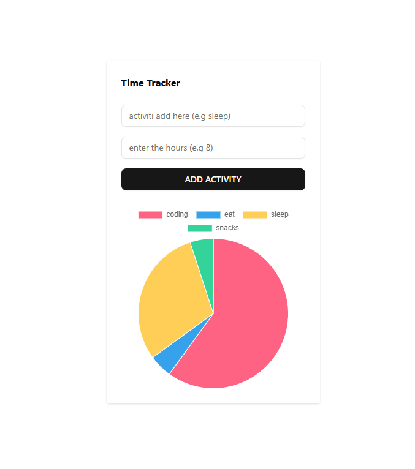

# ⏱️ Time Tracker (React + TypeScript + Vite)

A **Time Tracker Web App** built with **React, TypeScript, Vite, TailwindCSS, shadcn/ui, and Chart.js**.  
This project demonstrates how to **track tasks, visualize progress with charts, and manage time efficiently**.

---

## 📖 Table of Contents
- [🚀 Features](#-features)
- [📥 Installation & Setup](#-installation--setup)
- [🎨 UI Components Setup](#-ui-components-setup-shadcnui)
- [📊 Charts Integration](#-charts-integration-chartjs--react-chartjs-2)
- [📂 Project Structure](#-project-structure)
- [📸 Screenshots](#-screenshots)
- [🛠️ Tech Stack](#️-tech-stack)
- [🤝 Contributing](#-contributing)
- [📜 License](#-license)

---

## 🚀 Features
- ⚡ **Vite + React + TypeScript** setup with HMR  
- 🎨 **TailwindCSS** for styling  
- 🧩 **shadcn/ui** for modern UI components  
- 📊 **Chart.js + react-chartjs-2** for time tracking visualization  
- 📱 **Responsive design** with clean layout  
- ✅ Easy to extend and customize  

---

## 📥 Installation & Setup

### 1. Create Project
```bash
npm create vite@latest time-tracker
cd time-tracker
2. Install Tailwind CSS
npm install tailwindcss @tailwindcss/vite


Replace src/index.css:

@import "tailwindcss";

3. Configure tsconfig

Update tsconfig.json and tsconfig.app.json:

{
  "compilerOptions": {
    "baseUrl": ".",
    "paths": {
      "@/*": ["./src/*"]
    }
  }
}

4. Update vite.config.ts
import path from "path"
import tailwindcss from "@tailwindcss/vite"
import react from "@vitejs/plugin-react"
import { defineConfig } from "vite"

export default defineConfig({
  plugins: [react(), tailwindcss()],
  resolve: {
    alias: {
      "@": path.resolve(__dirname, "./src"),
    },
  },
})

🎨 UI Components Setup (shadcn/ui)
1. Initialize shadcn/ui
npx shadcn@latest init


Choose Neutral as base color.

2. Add Components
npx shadcn@latest add button


Usage in src/App.tsx:

import { Button } from "@/components/ui/button"

export default function App() {
  return (
    <div className="flex min-h-svh items-center justify-center">
      <Button>Click me</Button>
    </div>
  )
}

📊 Charts Integration (Chart.js + react-chartjs-2)
1. Install Packages
npm i chart.js@4.4.3 react-chartjs-2

2. Example Component src/components/TimeChart.tsx
import { Bar } from "react-chartjs-2"
import {
  Chart as ChartJS,
  CategoryScale,
  LinearScale,
  BarElement,
  Title,
  Tooltip,
  Legend
} from "chart.js"

ChartJS.register(CategoryScale, LinearScale, BarElement, Title, Tooltip, Legend)

const data = {
  labels: ["Mon", "Tue", "Wed", "Thu", "Fri"],
  datasets: [
    {
      label: "Hours Tracked",
      data: [2, 4, 3, 5, 6],
      backgroundColor: "rgba(59,130,246,0.7)"
    }
  ]
}

export default function TimeChart() {
  return <Bar data={data} />
}

3. Use in Dashboard
import TimeChart from "@/components/TimeChart"

function Dashboard() {
  return (
    <div className="p-6 space-y-6">
      <h1 className="text-2xl font-bold">Weekly Time Tracking</h1>
      <TimeChart />
    </div>
  )
}

export default Dashboard

📂 Project Structure
time-tracker/
├── src/
│   ├── components/
│   │   ├── ui/ (shadcn components)
│   │   └── TimeChart.tsx
│   ├── App.tsx
│   └── index.css
├── tsconfig.json
├── vite.config.ts
└── package.json

## 📸 Screenshots

Add your app screenshots here for better visibility.



Example:


🛠️ Tech Stack

React + TypeScript

Vite

TailwindCSS

shadcn/ui

Chart.js + react-chartjs-2

🤝 Contributing

Contributions are welcome!

Fork the repo

Create a feature branch (git checkout -b feature/your-feature)

Commit your changes (git commit -m "Add feature")

Push to branch (git push origin feature/your-feature)

Open a Pull Request